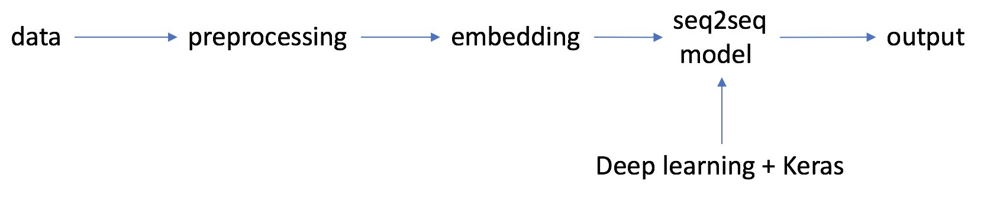

# chatbot
Build a ChatBot using seq2seq on gunthercox data set. Since the data set is very small, use pretrained word embedding. 

# architecture

# run
To run the server, go to the notebooks dir, and `python server.py`. You need to download Glove word embedding beforehand.
